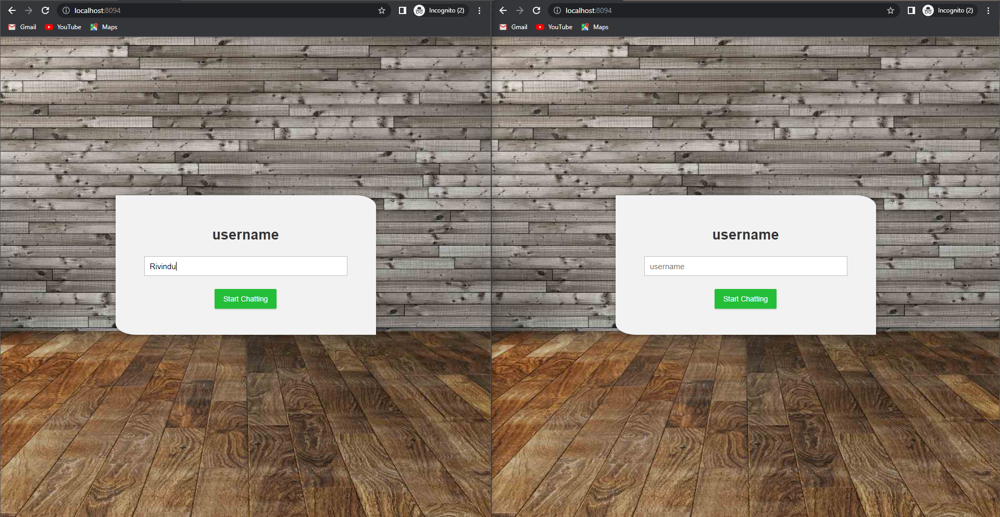
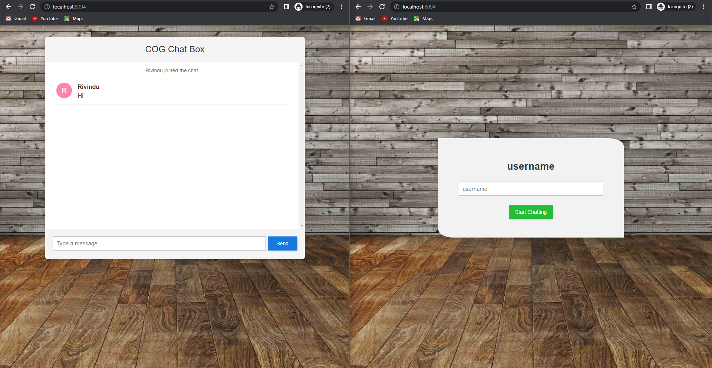
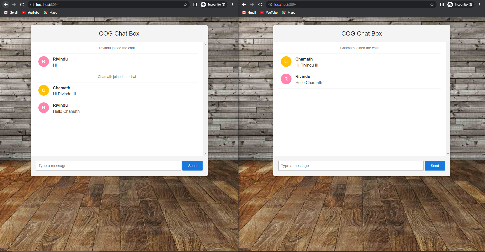
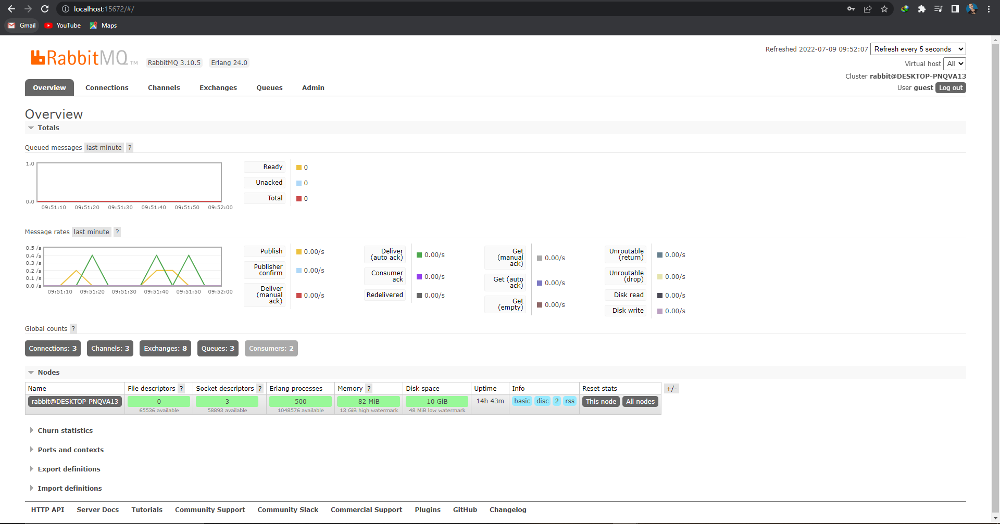

# Java-Web-Socket-application
#### In this Project Contain Java Socket Programing with Can Chat between Multi-client With Rabbit MQ and Simple web Config server
#### And also contain Kafka Producer and Consumer Both Functions

### Tools and Technologies
* Java (17)
* Streaming Text Oriented Messaging Protocol
* Maven
* Rabbitmq for Msg Queue 

### Requirements to Run MultiChat Application
***
* Clone Project And Open Project in Your Idea ( git clone https://github.com/rivinduchamath/Java-Web-Socket-application.git) 
* Install Rabbitmq and Enable Plugin STOMP (Streaming Text Oriented Messaging Protocol)

   ##### 1. Rabbit MQ : https://www.rabbitmq.com/download.html
   ##### 2. Start CMD: Run >> rabbitmq-plugins list ( Check Whether rabbitmq_stomp Plugin In RabbitMq Installation Directory) 
   ##### 3. Enable STOMP Plugin CMD >> rabbitmq-plugins enable rabbitmq_stomp

* Run SpringBootWebsocketApplication Class in Multi Chat Module (server.port=8094)
* Start Browser and Run http://localhost:8094/

* To Run Rabbitmq http://localhost:15672/
  ##### 1. Password : guest  ,  UserName : guest
  ##### 
********
Screen Shots
***

